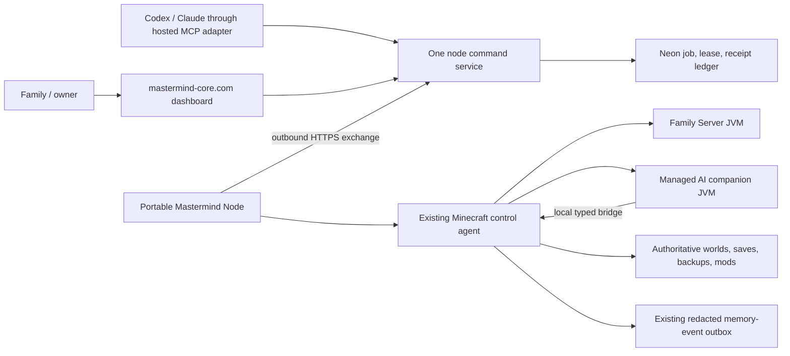

# Mastermind Portable Node Architecture

Status: accepted v1 architecture and authority map. This document describes how the hosted command center, the portable local runtime, Minecraft, the AI companion, memory, and MCP fit together without creating parallel control systems.

## Outcome

`mastermind-core.com` is the always-online command surface. A Mastermind Node is the one local ecosystem on the machine that owns the Family Server and AI companion. The node starts without a visible terminal, connects outbound, reports a redacted status, leases typed jobs, and maps them to the existing local safety boundaries.

The first remote vertical slice has only two capabilities:

- `node.status.read` — read the last node status and its freshness;
- `family-ecosystem.ensure-running` — converge the Family Server and managed AI companion to running/ready.

Both are routine, no-PIN operations. There is no remote shell, arbitrary path, executable, URL, Minecraft console string, secret field, or general-purpose proxy in this protocol.



The dashboard and MCP are two callers of the same service. They are not separate implementations of node control.

## Zero-ceremony rule

If Mastermind can safely generate, store, enter, migrate, or rotate a value, Mastermind does it. The user chooses intent and meaning, not UUIDs, hashes, environment-variable names, API tokens, lease identifiers, or database rows.

Human interruption is reserved for an external fact Mastermind cannot discover, genuinely new authority, irreversible data loss, or real-money spending. Pairing is a one-time intent; the generated machine credential is remembered and used invisibly afterward.

## One source of truth per concern

| Concern | Authority | Hosted representation | Must not become a second authority |
|---|---|---|---|
| Server and companion process ownership | Existing local supervisor and Minecraft control agent | Redacted, time-stamped status only | Vercel process guesses, persisted PIDs, browser lifecycle logic |
| Worlds, saves, backups, mods, runtime artifacts | Existing local Minecraft data root and managers | Typed job intent and redacted receipt only | Cloud copies presented as live state, generic file APIs |
| Companion movement and rapid game state | Existing loopback Family Bridge | High-level lifecycle result only | Internet WebSocket movement tunnel, raw snapshots in Neon |
| Remote command intent, lease, and completion | Hosted node exchange ledger in existing Neon memory database | Authoritative job/receipt rows | Vercel Queue or a second MCP job tracker in v1 |
| Family identity, consent, preferences, and memory | Existing Mastermind memory and identity system | Existing structured projections/vector storage | A node-specific player or memory database |
| Local lifecycle safety, recovery fences, and transaction locks | Existing local agent | Typed attention code | Hosted override or remote approval bypass |
| Hosted human identity | Existing Clerk owner/family gate | Authenticated actor reference | A second password or routine parental PIN |
| Node machine identity | Generated node bearer credential; secret held by host credential storage | SHA-256 digest and revocation state | Token in USB data, logs, browser storage, or vector memory |
| Microsoft Minecraft identity | Existing local DPAPI-backed account vault | Ready/not-ready enum only | Microsoft token or profile data in Vercel |
| MCP capability catalog | One shared hosted service/catalog | Adapters to the same capability IDs | Feature-specific MCP wrappers with their own rules |

The existing `/api/minecraft` and `/api/local-control` paths remain same-machine APIs. They must continue to reject Vercel and direct browser access. The existing `/api/orchestrator` loopback proxy and the legacy MCP facade scripts are not remote node ingress.

## Authority and friction policy

The policy matches the actual family threat model: prevent a toddler, a misclick, or an accidental model action from causing a large consequence without turning normal play into ceremony.

### Routine: frictionless

Routine includes status, safe start/stop, companion lifecycle, creating backups, memory and research, creative content, and creating/testing mods. It requires normal identity/capability authorization but no PIN or parent approval.

### Lightweight confirmation and undo

Publishing a tested change into a live world can show a clear summary and one lightweight confirmation when useful. Prefer a reversible plan, automatic pre-change backup, and an obvious undo path. This is not a hard parental gate by itself.

### Hard gate: narrow and consequential

A hard gate is allowed only for:

- irreversible data deletion, overwrite, or revert;
- purging the last recoverable backup/copy;
- real-money spending;
- creating or revealing credentials that enable spending.

Model vigilance is advisory. Deterministic system fences—typed inputs, lifecycle locks, backups, effect-once receipts, recovery checks, and bounded scopes—protect against misclicks and glitches.

### Local administration

Raw terminal/filesystem access, credential reset/revocation, and manual recovery are a separate local maintenance authority. They do not become Internet job types. `local-admin` describes an authority boundary, not an excuse to demand a parental PIN for every maintenance action.

## V1 protocol boundary

The canonical protocol package is `protocol/mastermind-node-exchange`.

- Requests and responses use strict exact-key validation and canonical recursively key-sorted JSON.
- One exchange carries one redacted status, at most 32 receipts, and receives at most one lease.
- Receipt sequences increase strictly per job within an exchange; durable prior-boot receipts remain valid replay candidates.
- An exchange response may acknowledge only receipt IDs submitted in that exact request.
- A returned lease must still be live at the response's authoritative `serverTime`.
- The only v1 command input is exactly `{}`.
- The command digest binds job ID, node ID, capability, capability version, policy class, and input.
- The node reports enum codes, never remote exception text or logs.
- Status excludes process IDs, paths, IP addresses, account/profile names, player/world snapshots, positions, executables, tokens, URLs, and console strings.

The hosted service uses short renewable leases and at-least-once delivery. The local executor writes an authenticated, atomic journal before issuing an effect. `ensure-running` is also naturally idempotent: after a restart or lost HTTP response the executor observes local state and resumes instead of blindly repeating a POST.

Durable unacknowledged receipts retain the boot ID that created them and may be replayed by a later boot. The authenticated node, job, lease, command digest, receipt ID, and sequence provide the scope; requiring the current exchange boot ID would make crash recovery lose valid completion evidence.

Success means:

- Family Server status is `running`;
- companion lifecycle is `running`;
- companion bridge is `ready`.

If the server starts but the companion is missing, signed out, locally kill-switched, or orphaned, the job returns a typed failure/attention result and leaves the server running. It never rolls a safe monotonic effect back merely to make a composite job appear atomic. A later retry resumes from the server-running stage.

## Pairing and machine authentication

Pairing is a one-time owner action:

1. the hosted command center creates a high-entropy pairing credential with a short expiry and stores only its digest;
2. before making the pair request, the local node generates its node ID and 256-bit secret, forms the complete opaque `mn1.<nodeId>.<secret>` credential, stores it in Windows Credential Manager/DPAPI, and hashes that exact UTF-8 credential string;
3. the pair request submits only the node ID and credential digest with its display metadata;
4. the hosted database consumes the pairing and records that caller-supplied node ID/digest atomically;
5. the response contains no credential; retrying the identical pair claim returns the same node identity and cannot strand a secret after a lost response;
6. Mastermind applies the locally retained credential automatically on every boot.

TLS plus a generated 256-bit bearer credential, hash-only cloud storage, strict capability inputs, job digests, leases, and effect-once receipts are the v1 security foundation. A private family project does not need mTLS, a certificate authority, hardware attestation, recurring token entry, per-request signatures, or manual rotation ceremonies.

Portable data does not contain the node bearer credential. Moving the USB package to another host causes one automatic/one-click host enrollment rather than copying a machine credential. The same rule already applies to machine-bound Microsoft DPAPI material: a foreign vault should degrade the companion to `sign-in-required`, not prevent the Family Server from operating.

## Local process topology

The existing local supervisor remains the only lifecycle owner:

```text
Mastermind local supervisor (hidden, auto-started)
├── local dashboard / recovery UI
├── Minecraft control agent
│   ├── Family Server JVM
│   └── managed AI companion JVM
└── Mastermind node link
    ├── outbound exchange loop
    └── local effect-once journal
```

The node link is a supervised hidden child, not another visible PowerShell window. It inherits the existing loopback control credential and calls the existing bodyless/typed local operations. It never opens an inbound Internet port.

The host registration/installer is responsible for starting the supervisor at Windows boot or logon. A production portable package should use its bundled Node runtime and Next standalone output so it does not depend on a globally installed development toolchain.

### Fixed Windows host v1

The Windows implementation keeps Task Scheduler deliberately boring. The exact current-user task is the root-level `\Mastermind Portable Node`, so a fresh profile needs no custom scheduler folder. Its action is the GUI-subsystem executable `%LOCALAPPDATA%\Mastermind\host-v1\MastermindNodeHost.exe`, with no arguments. Its task XML contains no portable-drive path, Node/npm/PowerShell command, URL, bearer, environment value, or other secret.

`npm run node:host:install` is the one-shot source-package enrollment operation. It requires an existing `npm run build` production output, then builds the self-contained `WinExe` host without opening child tool windows, copies the current Node runtime into a content-addressed fixed-host generation, writes a signed portable bootstrap manifest, writes the strict host config, and creates or refreshes the already-defined least-privilege current-user logon task. An unchanged re-run preserves the host/package IDs and signing identity. The v1 source installer still requires Node and the .NET 8 SDK on the enrollment machine; the later Prepare-USB package will contain the already-published host/runtime plus a double-click bootstrap so a destination laptop needs neither toolchain.

The host config is separate from the task and contains only pinned package/runtime identity plus a bundle location hint. The host validates its own GUI executable, the copied Node runtime, signed manifest, volume identity, and a deterministic inventory of the full executable source/runtime tree before it starts anything. It first tries the hint, then searches mounted drive roots for the same volume identity and root-relative bundle path; moving the same package volume from `E:` to `F:` on the enrolled Windows host therefore does not change the Scheduled Task. The launcher accepts no arguments or environment-supplied command, starts only `scripts\run-local-control.mjs --production` through its fixed copied Node runtime with `CreateNoWindow`, strips Node diagnostic injection variables before launch, remains resident to supervise it, and requests the supervisor's existing safe drain during Windows session shutdown.

Enrollment changes Task Scheduler only when the explicit installer CLI is run; importing the installer modules is inert. The task begins on the next interactive logon. Running the installer while an existing local supervisor is live is safe provided the production tree is not being rebuilt or otherwise mutated: the runtime is immutable/content-addressed, the fixed launcher is never overwritten while enrolled, and the new supervisor performs the existing authenticated graceful handoff at its eventual task start.

The native source lives under `native/windows/MastermindNodeHost`; generated binaries, the fixed LocalAppData host, the package manifest, and the Scheduled Task are activation artifacts rather than source-controlled secrets.

## Hosted topology

The first slice remains one Next.js App Router deployment plus the existing Neon database. It does not require a second Vercel Service, Vercel Queue, or an authoritative WebSocket.

- `/api/nodes/**` is the owner/family dashboard and hosted MCP service surface.
- `/api/node/v1/pair` and `/api/node/v1/exchange` are headless machine routes with their own bearer checks.
- The machine routes do not depend on browser cookies or Origin headers.
- The database function atomically applies receipts, renews/requeues leases, updates redacted status, and returns at most one job.

A future WebSocket may reduce latency, and a future queue may fan out events, but neither replaces the durable job/lease/receipt ledger.

## MCP routing

The long-term shared MCP surface exposes the same registry IDs through stable adapter names, for example:

- `mastermind_node_status` → `node.status.read`;
- `mastermind_family_ecosystem_ensure_running` → `family-ecosystem.ensure-running`.

The adapter calls the same hosted node service as the dashboard. Claude, Codex, and future agents therefore receive one catalog and one policy decision. The historical warm MCP host/portal pattern remains useful as the shared catalog and gate; feature-specific wrappers that advertise nonexistent endpoints should be retired or converted into clients of this service.

Raw filesystem/terminal MCP can remain available on a trusted developer workstation as a separate maintenance lane. It is not inherited by children, the public dashboard, or the node exchange.

## Offline and powered-off behavior

The hosted command center can accept a start intent while the node is offline. The job remains queued for its bounded lifetime and is leased when the node next connects.

A powered-off computer cannot receive HTTPS. Remote power-on requires one of these explicit physical foundations:

- BIOS/firmware auto-start and an always-on host;
- Wake-on-LAN sent by an already-awake trusted LAN relay/router;
- a small always-on Mastermind relay that can wake the larger machine.

The USB drive alone cannot power on an arbitrary laptop in another country. The dashboard must distinguish `queued/offline` from `started`, and show the last successful end-to-end exchange/receipt rather than declaring success because isolated components are green.

## USB portability boundary

Portable means the managed runtime and family data can move together; it does not mean every host fact is copied.

Portable:

- server/client artifacts and managed Java runtime;
- worlds, saves, backups, mods, logs, outbox, and node effect journal;
- root-relative manifests and trusted asset digests.

Host-bound and re-established:

- DPAPI/Credential Manager secrets;
- firewall/network profile and Wake-on-LAN capability;
- process identities, ports, and lifetime pipes;
- the interactive GPU/desktop session needed by the companion client.

Before claiming drive relocation, absolute paths currently persisted in instance/client/supervisor state must move to a root-relative schema or pass through one authenticated relocation transaction. Authenticated update markers cannot be text-replaced. A `Prepare USB for removal` operation must block mutations, safely stop the companion and server, drain receipts/outbox, close owned children, and verify exact exit before the drive is declared removable.

## Delivery sequence

1. Freeze and test the shared capability/exchange contract.
2. Add the Neon pairing/node/job/receipt migration and shared hosted service.
3. Add owner-facing node status/start routes and the headless pair/exchange routes.
4. Add the hidden supervised node link and effect-once executor.
5. Verify dashboard → hosted ledger → outbound node → existing local agent → receipt end to end.
6. Package production standalone runtime and one-time auto-start host registration.
7. Add authenticated root-relative relocation and `Prepare USB for removal` before advertising cross-machine USB movement.
8. Add optional Wake-on-LAN only when an awake trusted relay exists.

No later step should introduce another memory store, player identity model, mod manager, Minecraft lifecycle owner, command ledger, or MCP policy surface. New callers and interfaces attach to the authorities in this map.
