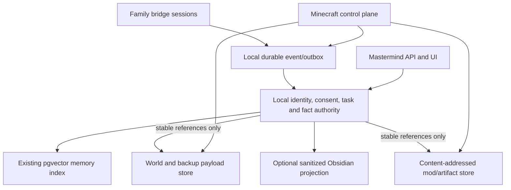

# Mastermind Shared Memory Fabric

Status: **accepted architecture direction; implementation is phased**.

## Decision

Mastermind projects are branches of one shared substrate, not parallel systems. Before a domain adds storage, memory, identity, artifact, session, or backup infrastructure, it must first check whether Mastermind already provides the same underlying capability and extend that shared primitive through a domain adapter where practical.

The Family Minecraft project will therefore reuse the existing Mastermind memory, archive, API, settings, key-management, and event seams. It will not create a second vector database or a Minecraft-only semantic-memory silo.

This follows the existing founding principle that infrastructure is universal and projects are branches inside it. It also preserves the original Family plan's key split:

- retrieval-worthy long-term memory belongs in the existing vector system;
- immediate task and recovery state belongs in ordinary durable storage;
- per-tick telemetry must not be vectorized.

## What already exists

Mastermind currently has:

- `harmonic_memories`: curated identity, toolbox, project, and session memories with 768-dimensional embeddings, tags, priority, recency, and optional archive references;
- `transcript_archive`: a large addressed document/conversation archive with provenance, topic tags, embeddings, subject/source trees, and semantic-neighbor lookup;
- a local session-logger MCP with hydrate, recall, memory write/update, archive navigation, and session-summary tools;
- the operational `/api/codex` read-only archive/search API and the `/codex` and `/map` navigators;
- operational chat/agent portal, settings, credential-management, module, Nexus, and Minecraft proxy APIs;
- typed companion bridge events, bounded state snapshots, action IDs, session IDs, world references, backup IDs, mod hashes, and signed control-plane manifests.

The following are not yet implemented as one system:

- durable family/player profiles, preferences, relationships, consent, and forgetting;
- durable companion task/session checkpoints across a control-plane restart;
- a bridge from Minecraft events into curated/vector memory;
- an authenticated family-memory API;
- Obsidian import or export;
- a unified content-addressed artifact catalog shared by mods, generated projects, and backup references.

Some legacy API documentation advertises `/v1/memory`, but no corresponding Next route exists. The current implementation must use verified operational seams rather than treating documentation-only endpoints as production APIs.

## One catalog, several authorities

The systems should share identifiers, provenance, policies, and lifecycle events. They should not force every payload into one database.



Authoritative boundaries:

| Concern | Authority | Shared-memory role |
|---|---|---|
| Player identity, parent/child role, consent | Local durable structured store | Scoped lookup metadata only |
| Current task, action, checkpoint, retry state | Local durable event/task journal | Later summary and semantic retrieval |
| Confirmed facts and preferences | Local durable fact records | Derived embeddings keyed by fact ID/version |
| World state and player NBT | Minecraft world files and signed world catalog | References, summaries, landmarks, provenance |
| Backups | Backup manager manifests and payloads | Searchable metadata and restore-history events |
| Mod/generated artifact bytes | Content-addressed filesystem/object store plus signed manifests | Description, provenance, compatibility, notes |
| Secrets and account tokens | DPAPI/credential vault | Never indexed or exported |
| Vector embeddings | Existing pgvector store | Rebuildable derived index, never authority |
| Obsidian notes | Human-readable projection/inbox | Never authority for identity, backup, audit, or deployment |

## Shared namespaces

Every record and retrieval request must have an explicit scope. Initial namespaces:

- `family/shared`
- `player/<personId>/private`
- `player/<personId>/shared`
- `world/<worldRef>`
- `session/<sessionId>`
- `companion/self`
- `system/technical`
- `project/<projectId>`

Authorization is applied before retrieval, not after semantic search. Developer/Codex identity memory stays separate from family/player identity memory; the current global `identity` layer must not be reused unchanged for children or players.

## Common event envelope

World, backup, mod, companion, and future workshop features should emit the same bounded envelope into a local outbox:

```ts
interface MastermindDomainEvent {
  eventId: string
  schemaVersion: number
  occurredAt: string
  producer: string
  domain: 'world' | 'backup' | 'mod' | 'companion' | 'player' | 'workshop' | 'system'
  kind: string
  namespace: string
  householdId: string
  playerId?: string
  worldRef?: string
  sessionId?: string
  correlationId?: string
  visibility: 'private' | 'family' | 'system'
  payload: Record<string, unknown>
}
```

Producers remain responsible for their own transaction truth. The memory consumer may summarize or index an event, but it cannot make an update, restore, mod promotion, or task completion authoritative.

The local outbox provides at-least-once delivery. A consumer must commit `eventId` in a durable unique receipt in the same transaction as its canonical state change before acknowledging the outbox file. Embedding directly into an existing memory table and then deleting the event without that receipt is not replay-safe.

Useful event families include:

- `world.created`, `world.activated`, `world.archived`;
- `backup.created`, `backup.verified`, `backup.restored`, `backup.purged`;
- `mod.installed`, `mod.removed`, `mod.profile_promoted`;
- `session.started`, `session.checkpointed`, `session.ended`;
- `action.requested`, `action.completed`, `action.blocked`;
- `preference.suggested`, `preference.confirmed`, `preference.forgotten`;
- `landmark.discovered`, `project.started`, `promise.recorded`.

## What should become memory

Promote small, useful, explainable facts:

- player-confirmed preferences;
- family projects and recurring goals;
- named homes, farms, portals, mines, builds, and danger areas;
- promises made by the companion;
- successful recovery methods and recurring failures;
- session summaries and unfinished tasks;
- mod purpose, compatibility, provenance, and family notes;
- backup/restore history and the stable IDs needed to inspect it.

Do not store or vectorize by default:

- every tick, movement sample, packet, or inventory frame;
- raw child chat or screenshots;
- access tokens, bridge credentials, private keys, or secrets;
- world/backup payload bytes or JAR contents;
- unconfirmed model guesses about a player;
- mutable task state whose loss would break recovery.

Learned preferences start as `suggested`. A player or parent promotes them to `confirmed`. Every surfaced memory should expose why it exists, its source, its scope, and a simple forget/edit action. Personalization is retrieval-based; family data is not used for model fine-tuning by default.

## Kid-proof operator boundary

The realistic home threat is accidental keyboard/mouse input, not a hostile local filesystem attacker.

- Child mode never exposes restore, purge, retention, mod promotion, identity management, or permanent deletion.
- Parent mode uses a short-lived unlock backed by a PIN or OS-authenticated operator session.
- High-impact actions use hold-to-confirm and show the exact target; a typed magic phrase is not the sole protection.
- Repeated submissions are idempotent and duplicate-safe.
- Archive/undo is preferred to permanent deletion where practical.
- Memory capture for a child is parent-controlled and defaults to summaries rather than raw history.

## Obsidian boundary

Obsidian is a useful human-facing view and source of design inspiration, not the database or backup system.

Phase one is a one-way, sanitized Markdown projection containing stable frontmatter IDs, revision, scope, provenance, and links to Mastermind entities. Appropriate exports include approved memories, world journals, build/project notes, session summaries, and mod notes.

If import is later useful, accept files only from a designated `Inbox`. Treat edits as proposals that pass schema, authorization, and conflict validation before becoming canonical records. Obsidian must never directly mutate identities, consent, backup manifests, audit journals, installed profiles, or secrets. Obsidian Sync is not a substitute for backup.

## Backup and recovery composition

A complete recovery point may reference:

- one verified world snapshot;
- one consistent snapshot/export of the local identity/task/fact database;
- signed world/mod/profile manifests;
- unique user-created artifacts not otherwise reproducible.

Embeddings and the vector index are excluded because they can be rebuilt from canonical fact/event records. Retention for worlds, task telemetry, memories, and artifacts remains independent even though their catalog entries cross-reference one another.

## Existing seams to reuse

- Companion session snapshots and action-status events become event/outbox producers.
- `FamilyWorldManager` supplies `worldRef`, version, lifecycle, and stack bindings.
- `FamilyServerBackupManager` supplies `backupId`, verification state, restore history, and signed manifest identity.
- `FamilyModManager` supplies project/version IDs, dependencies, artifact hashes, and profile generation.
- The session-logger/pgvector stack becomes a scoped derived-memory adapter after it is packaged and credential-safe.
- `/api/codex` remains the developer/research archive surface. Family/player memory gets a separate authenticated API and cannot inherit Codex's public-read policy.

## Delivery sequence

1. Define shared identity, consent, fact, event, checkpoint, and reference schemas in a local durable store.
2. Persist companion session events and resumable checkpoints from the existing bridge seams.
3. Add an idempotent outbox consumer into the existing pgvector memory adapter, including revoke/forget and full rebuild.
4. Add shared content-addressed artifact metadata while preserving signed deployment manifests.
5. Add compound recovery metadata and prove canonical restore before vector-index rebuild.
6. Add optional one-way Obsidian projection; add a reviewed inbox only if it proves useful.

## Implementation checkpoint: shared event spine

The first shared slice is implemented:

- canonical structural JSON Schema: `protocol/mastermind-domain-event/v1.schema.json`;
- strict shared runtime creator, semantic validator, canonical encoder, and deterministic event-ID helper at `protocol/mastermind-domain-event/contract.mjs`, re-exported by the Minecraft control plane; the runtime additionally enforces reference bindings, normalized sensitive-key rejection, nesting/node quotas, and the whole-event byte limit;
- bounded immutable file-per-event outbox at `private/shared-memory/outbox/v1/pending`;
- `wx` temporary creation, content flush, atomic publication, deterministic duplicate handling, bounded startup inventory, restart replay, and acknowledge-after-consumer-success semantics;
- companion producers for `session.started`, `session.ended`, `action.requested`, `action.completed`, and `action.blocked`;
- explicit redaction: raw snapshots, coordinates, action arguments, chat, progress details, error messages, and credentials are not copied.

Outbox failure is observable but cannot change authoritative companion behavior. Raw one-second snapshots remain in memory only. Companion capture is attached only when a canonical internal player UUID is configured, so an unbound control plane cannot accumulate playerless events. A bounded startup preflight detects any playerless companion files left by an earlier development build, preserves them unchanged, and disables capture/delivery with `EVENT_OUTBOX_IDENTITY_MIGRATION_REQUIRED` instead of blocking newer events silently. The player/household identity and purpose-specific consent authority and a separate parent operator console are now implemented in later additive migrations; player-facing recall remains a subsequent slice.

The current companion projector is ordered, catches sink failures, and drains on an orderly control-plane shutdown. It is intentionally downstream of authoritative session behavior, so an abrupt process loss in the short interval between an in-memory companion event and its outbox publication can lose that derived memory event. A later awaited checkpoint hook or reconciliation producer can close that availability gap without making memory persistence part of gameplay authority.

The control-plane delivery adapter is also implemented but disabled by default. After both memory migrations are applied and an internal player identity has been bootstrapped with `capture` and `session_summary` consent, enable it for a supervised development launch by setting `MASTERMIND_MEMORY_PLAYER_ID` to that canonical lowercase UUID and running `npm run dev:local -- --memory-event-sync` (or by setting the supervisor process environment variable `MASTERMIND_MEMORY_EVENT_SYNC_ENABLED` to the exact string `true`). Editing `.env.local` alone does not enable or bind the agent because Next loads that file only after the supervisor has spawned the agent. An enabled but missing or malformed player binding fails before outbox or consumer work. When enabled, the agent posts canonical player-bound events to the fixed loopback route `http://127.0.0.1:3000/api/memory/events` with the supervisor-shared control token. Only an exact `applied` or `duplicate` receipt for the same `eventId` acknowledges an outbox file. HTTP rejection, malformed or oversized responses, timeouts (including stalled response bodies), and a not-yet-started Next process remain observable retry conditions. Startup, timer, manual, and shutdown drains cannot overlap; orderly shutdown closes the bridge, flushes the producer, performs one final drain, and then closes the consumer. Memory delivery never becomes game authority.

## Implementation checkpoint: scoped memory ingestion

The receiving side of the event spine is implemented as an additive, unapplied migration plus a POST-only Node.js App Router endpoint:

- `memory-system/migrations/001_mastermind_domain_events_v1.sql` defines immutable event receipts, scoped companion sessions, scoped companion actions, and deterministic session-rollup projection jobs;
- `src/app/api/memory/events/route.ts` accepts only bounded canonical events from the fixed loopback control-plane origin with the shared supervisor bearer token;
- receipt insertion and every structured state/projection mutation execute through one PostgreSQL function call and one database transaction;
- the same event ID and digest is a duplicate success, while the same ID with different canonical bytes is a conflict and remains pending in the local outbox;
- all five current companion event kinds receive durable receipts and structured state, but raw events do not each become vectors;
- a session with actions produces one sanitized, stable rollup job containing only action-kind and terminal-status counts; reconnects and out-of-order terminal events refresh that same job deterministically;
- unknown future event kinds retain envelope provenance and a digest, but their payload is not persisted until a projector explicitly supports them;
- projection embeddings are nullable and rebuildable. No embedding call occurs in the ingest transaction, and no embedding worker is included in this slice;
- existing `harmonic_memories` rows are untouched so globally hydrated developer identity/toolbox memory cannot accidentally absorb family-scoped data.

The migration has **not** been applied to a live database, and event synchronization remains disabled by default. Applying the migration is an explicit operator step after review; enabling synchronization is a separate explicit supervisor launch choice.

## Implementation checkpoint: family identity and consent

The canonical household/player authority is implemented as a second additive, unapplied migration and a service-only command API:

- `memory-system/migrations/002_mastermind_family_identity_v1.sql` defines households, internal players, external identity bindings, purpose-specific consent, effect-once command receipts, and an append-only payload-free audit;
- internal lowercase UUIDs are the only `playerId` values carried by domain events. Minecraft profile UUIDs, Clerk subjects, and local identifiers remain canonical external bindings; display names and aliases are never authorization keys;
- mutations are limited to household bootstrap, player registration, identity binding, consent changes, and archival. After bootstrap they require an active parent actor, use target revision compare-and-swap, and are idempotent by command ID plus canonical digest;
- consent is default-deny and purpose-specific. Missing consent never inherits from a parent/child role;
- database guards reject companion event capture unless the bound player is active and has `capture=allow`, and reject session-rollup projection unless the same canonical player/session has `session_summary=allow`;
- `mastermind_can_read_memory_v1` is the shared pre-ranking authorization predicate. It requires active identity plus `recall=allow`, respects private ownership and `family_share`, derives session ownership from canonical state, and excludes technical/system memory from player results;
- `src/app/api/memory/identity/route.ts` is a bounded POST-only Node.js service route protected by the same exact loopback and supervisor bearer boundary as event ingest. Requests cannot supply an authorization result or bypass the database parent/revision checks;
- `services/minecraft-control-plane` requires a canonical `MASTERMIND_MEMORY_PLAYER_ID` whenever memory sync is enabled and binds it into every companion event before any delivery work begins.
- an unbound control plane does not open the durable event outbox. When binding is later enabled, the bounded outbox identity preflight fences any legacy playerless companion records for explicit operator migration without deleting or acknowledging them.

This service route is deliberately not a browser identity-management surface. The parent operator UI uses a separate same-origin, short-lived-unlock boundary and does not reuse the generic settings route or receive the service bearer. Player-facing semantic recall remains deferred until an authenticated runtime binding can resolve the principal server-side and apply the database predicate inside the candidate query before vector ordering.

The memory migrations remain **unapplied**, and memory synchronization remains **off by default**. This checkpoint was validated structurally and with offline tests; it has not executed against a live PostgreSQL database.

## Implementation checkpoint: operational identity bootstrap

The first identity setup path is deliberately narrow and supervisor-owned:

- `npm run memory:identity:plan -- --out <new-plan-file>` creates a bounded canonical plan with `wx`; it never overwrites a file or contacts the API/database;
- the fixed `family-local` plan bootstraps one parent, registers one internal service player, then grants only `capture` at service revision 1 and `session_summary` at revision 2;
- command and player UUIDs are generated once and retained in the plan, so an interrupted apply can safely retry the unchanged command IDs and receive exact `duplicate` receipts;
- the plan cannot contain a child, external binding, sharing/recall/preference/export consent, or archival command;
- `npm run dev:local -- --family-identity-bootstrap <plan-file>` loads the bounded explicit plan before launching children, waits for the local Next API without credentials, and only then submits each canonical command using the supervisor's in-memory bearer;
- bootstrap mode rejects memory synchronization, any inherited `MASTERMIND_MEMORY_PLAYER_ID`, and unconsumed launcher arguments. It does not bind a Minecraft account or open a browser UI;
- only an exact `applied` or `duplicate` receipt carrying the expected command ID and player ID advances the sequence. Store/migration failures, conflicts, malformed/oversized replies, stalled bodies, and ambiguous transport stop the sequence without deleting or rewriting the retry plan;
- after success the one-shot supervisor prints the internal service UUID, retains the plan, drains its managed control process, and stops. Memory sync is a separate restart using that UUID in `MASTERMIND_MEMORY_PLAYER_ID` plus `--memory-event-sync`.

The bootstrap plan is an operator recovery artifact, not a bearer or authorization grant. It contains stable internal IDs and exact intended commands but no control token, database credential, child profile, Minecraft profile, or browser identity.

## Implementation checkpoint: parent Memory console and reversible forgetting

The first browser-facing memory administration slice is implemented as a third additive, unapplied migration and a separate Memory tab:

- `memory-system/migrations/003_mastermind_memory_operator_v1.sql` adds an active-parent administration predicate, bounded search over sanitized session-rollup projections, a rebuild-stable lifecycle overlay, short-lived digest-bound forget plans, and payload-free effect-once action receipts;
- a missing lifecycle row means active revision 1. Forgetting writes a tombstone and increments the revision; restoring increments it again. Neither operation deletes source receipts, world data, backups, or projection provenance;
- active and forgotten searches apply household and active-parent authorization inside the database query before ordering. Results expose only bounded summary metadata, never embeddings, raw event payloads, receipts, or database errors;
- the current ranking is honestly reported as `text` or `recent`. Embeddings are nullable and no embedding worker is part of this checkpoint, so the UI does not claim semantic search yet;
- `/api/memory/operator/*` is a browser-only lane: exact loopback host and same-origin requests, optional Clerk-owner defense when fully configured, mandatory active-parent database verification, a non-sliding short-lived HttpOnly session, and a globally rate-limited scrypt PIN unlock. It never receives or exposes `MASTERMIND_CONTROL_TOKEN`;
- the Memory tab has no permanent-delete action. Forget requires a server-created 1.5-second plan plus a pointer hold; restore is idempotent. Keyboard activation cannot confirm the forget action, and ordinary key presses do not extend the parent session;
- unlock state is bounded across tab switches, explicit lock revokes the active local session, and cross-tab lock signals prevent a stale response from silently reopening the console.

Setup remains local: apply migrations 001, 002, and 003 in order, apply the retained family bootstrap plan, and start the local supervisor normally. This private-PC build defaults to the retained plan's parent identity and the salted scrypt verifier for family code `795200`, so neither the verifier nor the operator player UUID needs to be copied into `.env.local`. The raw PIN is not stored by the application. Explicit server-only environment overrides and `npm run memory:operator:pin` remain available for later rotation, and any override verifier is stripped from the environment inherited by managed control-plane children.

This console administers only sanitized family-memory projections. It is not player-facing recall, identity editing, consent editing, permanent deletion, embedding backfill, or an Obsidian bridge.

## Immediate constraints

- Some legacy memory scripts contain inline database configuration. This is accepted for the current private, non-sensitive deployment and is not an integration blocker. It can move into the existing credential system later if the deployment or data sensitivity changes.
- The repository copy of the session logger depends on packages and pre-existing database schemas not currently created by the root install; package and migrate it before calling it an in-repo service.
- Family/player roles, consent, and the parent operator unlock exist in unapplied migrations. The loopback bearer remains a service boundary, not a browser parent/child login; player-facing principal resolution is still pending.
- The current World/backup/mod managers stay authoritative. Memory integration must consume their stable output rather than weaken or replace their transaction logic.
