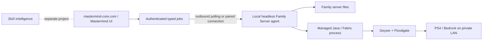

# Minecraft projects in Mastermind

Minecraft is one section of the larger Mastermind environment. Its projects are siblings, not modes of one installation:

| Project | Purpose | Version policy |
| --- | --- | --- |
| Family Server | Managed Java/Fabric server with Bedrock cross-play | Newest release with a complete metadata-compatible Fabric API, Geyser-Fabric, and Floodgate-Fabric stack |
| 2b2t Intelligence | Existing telemetry, client mod, and intelligence panels | Separately pinned to the game version required by 2b2t |

They do not share an installation, inventory, lifecycle, data directory, version, or credentials. Family state lives under `%LOCALAPPDATA%\Mastermind\minecraft\projects\family-server`. On its first version-2 start, the manager can discover the single older Family Server under `%LOCALAPPDATA%\Mastermind\minecraft`, copy the complete instance and world into the isolated project, verify both copies by SHA-256, and leave the original untouched. That imported copy is stopped and cannot launch until its Minecraft-version migration is explicitly approved.

## Validation status

The Family Server has now been migrated from 1.21.4 to 26.2 and exercised locally. Mastermind installed and selected the required managed Java 25 runtime, started Fabric, loaded the copied world, observed Minecraft readiness, started Floodgate and Geyser 2.11.1, and received successful Java status and RakNet/Geyser UDP pings. A Java Edition client had already connected and played successfully on the earlier local flow. PS4 discovery remains unverified until the Windows LAN boundary is enabled and a console connects.

After the 26.2 transaction reached verified readiness, the duplicate legacy Family directory and the retired standalone Bedrock Dedicated Server directory were sent to the Windows Recycle Bin, and the stale legacy instance name was removed from its registry. Neither can reserve a name or port. Mastermind retains only the isolated transaction backup under its managed backup root; that copy is inert, has no process or port ownership, and exists solely for recovery until it is deliberately purged.

## Start the local manager

```powershell
npm run dev:local
```

Open `http://localhost:3000`, select **MINECRAFT > FAMILY SERVER**, accept the Minecraft EULA, and select **PROVISION SERVER**. Next.js and the loopback agent share an ephemeral control token which is neither committed nor returned to browser JavaScript.

One transition is intentionally manual on this PC: the command center currently running predates the authenticated supervisor protocol. Before the first launch of the new supervisor, stop the Family Server from the existing UI, wait for **STOPPED**, close that old command-center terminal, and then run `npm run dev:local`. The launcher will not kill that older UI, agent, or Java process by PID. After this first supervised launch, subsequent command-center handoffs use the authenticated drain protocol automatically.

Requirements are Node.js 20 or newer and internet access during provisioning. Java is managed automatically: the agent reads Mojang's requirement and installs that exact runtime component. Minecraft 26.2 currently requires Java 25, so the older Java 21 runtime on this PC is not used for that server. Runtime files, manifests, sizes, and hashes are validated before the executable is privately pinned to an instance.

### What Mastermind can reuse from Modrinth

The installed Modrinth app already demonstrates the right shape and currently has an isolated `Fabric 26.2` profile plus shared `assets`, `libraries`, `log_configs`, `natives`, and `versions` caches. Mastermind can optionally use those directories as a **read-only download seed**: a candidate file is copied only after its size and publisher-pinned digest match the official Mojang/Fabric descriptor. This can avoid downloading hundreds of megabytes again.

Mastermind will not launch through the Modrinth GUI, modify its profile, read its account database, or borrow its tokens. The Family AI client still gets its own managed directory, manifest, exact process identity, bridge credential, and lifecycle. A missing or modified Modrinth cache entry simply falls back to the official verified download.

## Latest metadata-compatible provisioning

The browser cannot submit a Minecraft version. The local agent:

1. reads Mojang's current release manifest and per-release Java requirement;
2. requires compatible Fabric Loader and installer releases;
3. resolves exact-game-version Fabric API, Geyser-Fabric, and Floodgate-Fabric builds from pinned Modrinth project IDs;
4. downloads only from pinned HTTPS hosts and verifies artifact sizes and hashes;
5. atomically creates the Fabric server using managed Java;
6. keeps `online-mode=true` and configures Geyser to use Floodgate authentication.

If Mojang publishes a version before the whole stack supports it, Mastermind selects the newest complete compatible release rather than mixing incompatible files. Official Geyser builds are sometimes labelled `beta` on Modrinth, so the manager exposes that type and calls the result **metadata-compatible**, not runtime-verified or stable.

Provisioning resolves the current stack for new instances. Existing instances use the same trusted resolver and a transactional update workflow:

1. component-only changes on the same Minecraft release can apply automatically while stopped;
2. a Minecraft release change or legacy import requires an explicit plan-specific owner approval in the GUI;
3. the manager copies and hashes the complete world and protected mutable state, builds a same-volume candidate, and retains the complete prior instance as a recoverable backup;
4. directory publication and inventory commit are transactional, with rollback and startup reconciliation after interruption;
5. the updated instance remains `pending-unverified` until both Minecraft and Geyser report readiness in logs.

Downgrades and releases whose ordering cannot be proven are blocked. Backups and failed candidates are not silently deleted.

Once an upgraded server is **stopped** and the new stack has reached **verified** readiness, its instance card offers **PERMANENTLY DELETE RETIRED VERSION**. This typed, bodyless action deletes only that transaction's validated rollback backup and exact obsolete version-specific Fabric caches, updates the inventory atomically, and leaves the current server and world intact. It requires an explicit confirmation and cannot be undone.

## Family Server Modrinth add-on manager

The Family Server dashboard now includes a Family-only Modrinth add-on manager. It does not read, alter, or share state with the 2b2t project. Catalog search and project detail are read-only; public responses contain opaque references and redacted metadata rather than Modrinth IDs, download URLs, filenames, hashes, or local paths.

- A change begins as a short-lived, stack-bound plan. Install, update, remove, and rollback operations require the Family Server to be stopped and quiescent under the same lifecycle lock used by Start, Stop, Backup, and stack Update.
- Candidates must match the exact managed Minecraft and Fabric versions and advertise a supported server-safe environment. The manager selects listed releases, resolves recursive required dependencies, verifies declared size and SHA-512, and inspects each JAR and its Fabric metadata before publication. Optional dependencies are not installed automatically.
- Unmanaged files in the live mods directory block add-on mutations. Managed add-ons also block a Minecraft/Fabric stack update until a future resolver can prove the complete add-on set compatible with the new stack.
- Plan, operation, marker, and audit records are authenticated with a local HMAC chain. Atomic directory publication, durable operation records, and startup reconciliation provide rollback and fail-closed crash recovery; inconsistent or unauthenticated state raises a recovery fence rather than guessing.

These controls establish provenance and transactional integrity, not trust in mod behavior. A verified mod is still arbitrary Java code executing with the current Windows user's authority, and a matching hash does not prove that the code is safe. Running the server under a dedicated restricted Windows service account, with narrow filesystem permissions and network policy, is the recommended next hardening step.

The full serialized control-plane suite currently contains 292 tests: 290 pass and two Windows symlink-defense cases are skipped when the test account lacks permission to create symlinks. No add-on was installed into the live Family Server during this work.

## Operator backups and verified restore

The Family Server panel now has a separate operator-backup system. It does not reuse or apply retention to version-update rollback backups.

- Manual, automatic, verification, purge, and restore mutations require the server to be fully stopped under the same lifecycle lock used by Start and Stop. A stopped label alone is insufficient: the manager also requires no owned child or persisted process identity and confirms both the selected Java TCP port and Geyser UDP port are free.
- Automatic backups use fixed 6, 12, 24, 72, or 168 hour intervals. They never stop a running game. A due snapshot remains visibly deferred and runs after the server reaches a verified stopped state.
- Snapshots include the configured world, administrator lists, server properties, custom mods and mod-owned state, Floodgate private state, and unknown user-owned files by default. The Floodgate key remains inside private local backup storage and is never returned through the API. Exact managed artifacts—including the current Geyser configuration—plus libraries, version caches, logs, crash reports, and `session.lock` are excluded so a restore preserves the verified current stack.
- Every snapshot records per-file SHA-256 values plus a canonical tree digest. The list shows the **last recorded** verification time; **Verify backup** performs a new full disk re-hash.
- Restore is two-step. A short-lived approval is bound to the selected backup digest, current mutable-state digest, and current managed stack. Any intervening change invalidates the approval.
- Before publication, restore must create and verify a separate rescue snapshot of the state being replaced. It then builds a sibling candidate from the current verified server stack, replaces only mutable state, verifies the candidate, and publishes with atomic directory renames. The selected backup must belong to the current Minecraft version, so restore cannot downgrade the server or world across releases.
- Restore phase markers are reconciled at agent startup. Before publication, an interruption discards only the candidate; after the original directory is moved, recovery restores it. Inconsistent layouts fail closed as manual recovery rather than guessing or deleting data, and the recovery fence blocks Start, Update, and retired-version cleanup until the layout is safe.
- Retention applies only to automatic snapshots. Manual snapshots, rescue snapshots, the newest verified snapshot, and update-transaction backups are protected from automatic deletion. Explicit purge uses a validated backup ID and confirmation; callers never provide a filesystem path.

Long-running mutations have a six-hour local request window. If the browser loses the response, it reports **completion unknown**, locks further backup mutations, and reconciles against two serialized inventory reads. It never labels an ambiguous restore as an offline agent or retries the mutation automatically.

Backup contents stay under `%LOCALAPPDATA%\Mastermind\minecraft\projects\family-server\operator-backups`. The browser receives only IDs, kind, timestamps, Minecraft version, file/byte counts, last integrity result, and allowed actions.

## Typed server administration

The Family Server dashboard exposes a bounded administration surface rather than a free-form Minecraft console.

- Supported operations are player-list refresh, whitelist-list refresh, broadcast, whitelist on/off/add/remove, kick, ban, pardon, op, and deop. The browser cannot submit a slash command, selector, executable, path, environment variable, or arbitrary console fragment.
- Every operation is validated again by the local agent and serialized under the same instance lifecycle lock as Start, Stop, Update, and Backup. Immediately before writing, the process manager requires the exact running Family Server child and its authenticated writable stdin handle. A manager restart intentionally disables administration for an orphaned JVM.
- Each mutation has a UUID request ID and a durable redacted pre-write journal. Retrying the same request ID returns its recorded result instead of repeating the command. Broadcast text and moderation reasons are not copied into public status or audit responses.
- A successful stdin write is reported as **accepted / application unconfirmed**. Mastermind does not claim that Minecraft applied a ban, privilege change, or whitelist mutation merely because the process accepted bytes.
- Manual account entry is restricted to standard Java account names. Selectors, control characters, line breaks, and command delimiters are rejected. Bedrock/Floodgate identity administration will use the future authoritative Fabric server bridge rather than guessing from an Xbox display name.
- Vanilla console output does not provide a stable authenticated state API, so player and whitelist refreshes request bounded console output but remain explicitly unavailable as authoritative snapshots. The typed server bridge is the planned source for exact live player UUIDs, editions, and whitelist state.

Privilege, punitive, and whitelist-disable actions require an explicit dashboard confirmation. A lost HTTP response is treated as completion-unknown and is never automatically retried.

## Geyser, Floodgate, and PS4 on the home LAN

- Geyser translates Bedrock traffic to the Java server.
- Floodgate lets a Bedrock account join without a separate paid Java account.
- Geyser binds `0.0.0.0:19132/UDP`; the selected Java TCP port is stored per instance.
- Floodgate's `key.pem` stays local and must never enter Git, Vercel, Neon, logs, or UI responses.

Select **ENABLE HOME LAN** in the Family Server panel. The local agent derives the ports from the managed instance and Windows presents one UAC prompt. The browser cannot provide a script, command, executable, path, or port. The equivalent trusted helper invocation is:

```powershell
powershell -ExecutionPolicy Bypass -File .\scripts\configure-family-server-lan.ps1 -Action Enable -JavaPort 25565
```

It creates only **Private profile + LocalSubnet** inbound rules for Geyser UDP `19132` and the selected Java TCP port. It refuses to enable rules if the active default-route adapter is not Private. It does not reclassify the network, configure router forwarding, or expose the server to the internet.

```powershell
.\scripts\configure-family-server-lan.ps1 -Action Status -JavaPort 25565
.\scripts\configure-family-server-lan.ps1 -Action Disable
```

Direct LAN discovery is the primary path. Geyser's official setup guide says Bedrock players on the same network can join the LAN server from the Friends tab. The dashboard reports the private LAN address, firewall state when Windows permits inspection, UDP ownership, and whether port 19132 is available to Geyser.

Only one process can own UDP `19132`. The retired standalone Bedrock server that previously occupied it has been stopped and recycled. The managed 26.2 Java process now owns both TCP `25565` and Geyser UDP `19132`.

The active default-route Windows network, **Batsignal**, is currently classified Public. The LAN helper therefore refuses to create an inbound exception. Changing it to Private is a separate, explicit owner-authorized Windows security decision; once approved, Mastermind can add only Private-profile, LocalSubnet-scoped TCP `25565` and UDP `19132` rules. Until then the server remains healthy locally, but PS4 LAN ingress is not claimed as ready.

## Port and process ownership on start

The local launcher and Family Server start path record signed, exact Mastermind process identities, including PID creation identity, executable, command fingerprint, parent, and workspace. A per-workspace lifetime lease permits only one supervisor generation; concurrent launches race atomically and only one may proceed. If the current agent owns the Java child and its authenticated stdin, **Start** first writes Minecraft's `stop` command, waits for a clean JVM exit, verifies both the selected Java TCP port and Geyser UDP `19132` have been released, and only then launches the replacement. There is no Java PID-kill fallback.

If Java survived an agent crash, the new agent preserves it as an orphan and returns `SAFE_STOP_REQUIRED`; it does not claim that the server stopped and does not terminate it. A foreign port owner, PID reuse, changed identity, incomplete supervisor state, or failed supervisor drain also fails closed. The process is reported but is never terminated merely because it occupies `3000`, `43100`, `25565`, or `19132`. Supervisor-to-supervisor restarts are automatic only after the old agent has atomically blocked mutations, safely drained its owned Java child, released both game ports, and the exact old supervisor has exited.

BedrockConnect or a LAN proxy is a troubleshooting fallback only if the Family Server does not appear under **Friends > LAN Games**.

Official references:

- [Geyser setup](https://geysermc.org/wiki/geyser/setup/)
- [Geyser supported versions](https://geysermc.org/wiki/geyser/supported-versions/)
- [Floodgate setup](https://geysermc.org/wiki/floodgate/setup/)
- [Geyser console guidance](https://geysermc.org/wiki/geyser/using-geyser-with-consoles/)

## Local and hosted boundaries



The implemented local path is browser > same-origin Next route > token-protected `127.0.0.1:43100` agent. The agent is a headless supervisor, not a second GUI: it owns files, managed Java, updates, processes, and private credentials while the Mastermind web application remains the operator interface.

Vercel cannot reach a user's loopback address. The hosted bridge is therefore a separate next phase: an owner pairs this PC once, the local agent makes outbound-only HTTPS lease requests, and `mastermind-core.com` stores only typed, expiring, idempotent jobs and redacted events. Initial job types are limited to provision, update, start, stop, and LAN enable; arbitrary paths, URLs, executables, console commands, and secrets are not valid job payloads. Long jobs renew short leases, and a local journal prevents a reconnect from executing the same job twice. Device, pairing, and lease tokens are stored hash-only in the cloud; the device token stays in Windows DPAPI/Credential Manager. No inbound PC port is opened and Microsoft/Floodgate credentials never go to Vercel.

## Microsoft device-code authentication

Device-code authentication is a passwordless browser handoff for a desktop/public client. The local agent requests a code, the operator approves it on Microsoft's page, and the agent completes the Xbox/XSTS/Minecraft exchange. The reusable refresh record is encrypted with Windows CurrentUser DPAPI. React, Next.js, Neon, Vercel, logs, and server inventory receive only redacted account state.

For Mastermind, the Entra application is a **public desktop client**. Its application/client ID identifies the registration but is not a password or API secret; no client secret belongs in the desktop app. Device code flow does not require a redirect URI. The GUI may eventually store the client ID in local configuration, display the short `user_code` and Microsoft's fixed verification URL, and show redacted sign-in state. The `device_code`, Microsoft/Xbox/XSTS/Minecraft tokens, and refresh cache remain inside the local agent and are protected for the current Windows user.

Device code authorization by itself does not guarantee Minecraft Services access. A custom Entra registration can successfully complete Microsoft, Xbox, and XSTS authentication and still receive `Invalid app registration` from Minecraft Services. Mastermind will therefore require an explicitly supplied public-client registration and report that condition honestly; it will not embed or impersonate a first-party launcher client ID.

Companion-client authentication is local and separate from Floodgate identity and the Family Server JVM. The public client ID is stored in a bounded local registration record; replacing it first clears the prior DPAPI vault and in-memory session.

## Family AI client bridge (M2)

The Family AI body is a new, client-only Fabric project at `minecraft/family-agent-bridge`. It targets Minecraft 26.2, Fabric Loader 0.19.3, and Java 25. It does not import, modify, or share runtime state with the version-pinned `mastermind-client` 2b2t mod.

The bridge connects outbound to the local control plane at `ws://127.0.0.1:43100/v1/companion/bridge`. Each launch gets a separate 256-bit bridge credential in the child environment and the exact managed Family Server port; neither value is accepted from the browser. The local service stores only the credential hash, verifies the launched JVM's PID, creation identity, executable, arguments, working directory, and version manifest, and exposes only redacted lifecycle state. A control-plane restart preserves an unknown surviving client as an orphan and never terminates it by a persisted PID.

Minecraft normally receives its short-lived account access token as a game argument, which exposes it to operating-system command-line inspection. Mastermind's separate Java 25 bootstrap reads one bounded MFC1 credential frame from a private child stdin pipe, validates it, closes the pipe, and invokes Fabric KnotClient inside the same verified JVM. Its command line contains only verified JVM/classpath/profile values. Minecraft 26.2 auto-connect uses its supported `--quickPlayMultiplayer 127.0.0.1:<managed-port>` option. The bootstrap and lifecycle never log credential values; a failed pipe is terminated before process-identity admission.

Protocol v1 is strict, typed, and capped at 64 KiB. It provides heartbeats, bounded state snapshots, direct chat/look/move/jump/attack actions, cancellation, action deadlines, graceful shutdown, stale-state dead-man behavior, and a local F8 emergency-stop latch which cannot be reset remotely. Actions are accepted only while the client reports a fresh in-world snapshot for the managed Family Server. Raw Baritone/chat commands, shell commands, paths, URLs, arbitrary key names, and credentials are not protocol fields.

The standalone bridge, local agent boundary, dashboard status/actions, and the separate hash-pinned Baritone 1.18.0 provider now build and pass their automated checks. Navigation uses Baritone's typed API for navigate, follow, bounded gather/explore, escape, and return-to-named-waypoint; it never sends Baritone chat commands. Fabric API, the bridge, the provider, and the Baritone runtime remain four separately verified artifacts so a missing or modified dependency fails closed.

These artifacts have **not** been installed or launched against the live Family Server. The managed Mojang/Fabric provisioner, Microsoft device-code/DPAPI foundation, and internal async launch factory are implemented. The browser can request only bodyless provision/start/stop operations; it cannot submit a command, path, executable, argument, download URL, token, or server target. Each start re-verifies the installed client, refreshes an expired local session, derives the exact owned Family Server port under its lifecycle lock, resets only trusted mutable runtime-native directories, and passes credentials through stdin. M2 acceptance remains open: sign-in, client provisioning, launch, navigate, follow, gather/mine, cancel, and stop must pass in a controlled live test.

## Shared Mastermind memory fabric

Family Server memory is a branch of Mastermind's existing memory and API substrate, not a separate vector system. Immediate task/recovery state remains in ordinary durable storage; long-term social, world, technical, and session memories are derived into the existing vector/archive layer through scoped adapters. World files, backup payloads, mod artifacts, identity/consent, audit state, and secrets remain in their appropriate authoritative stores and meet only through stable IDs, provenance, policies, and domain events.

The accepted integration architecture, kid-proof permission boundary, Obsidian projection model, and phased delivery plan are documented in [Mastermind Shared Memory Fabric](./MASTERMIND_SHARED_MEMORY_FABRIC.md).

The first integration slice is now present: a strict versioned domain-event contract, a bounded durable file-per-event outbox, and redacted companion session/action producers. It deliberately excludes raw one-second state snapshots and remains downstream of Minecraft's authoritative session, world, backup, and mod state. Delivery is at-least-once; the future memory consumer must durably deduplicate `eventId` before acknowledging an event.
